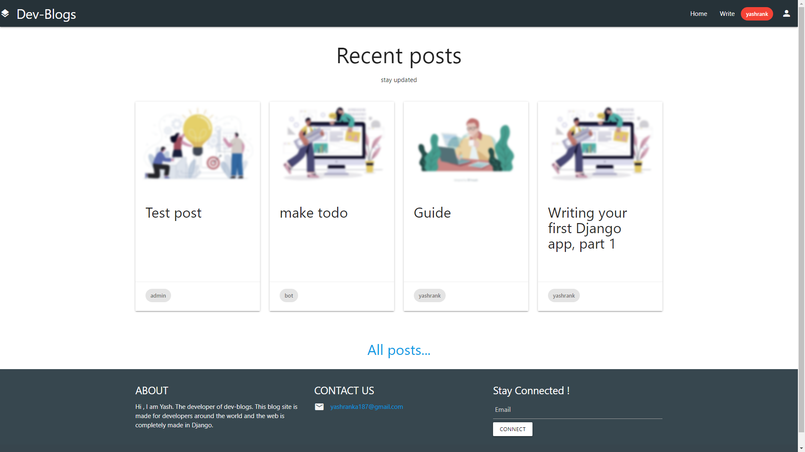
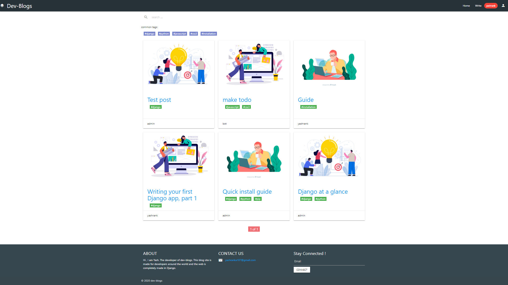
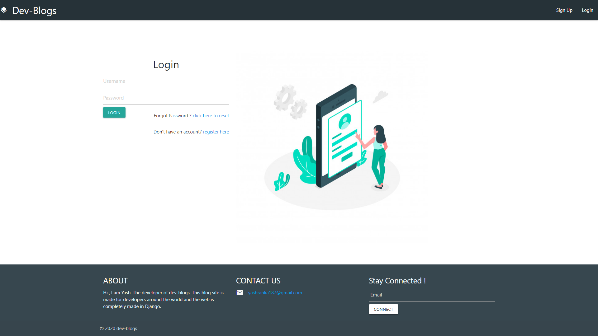
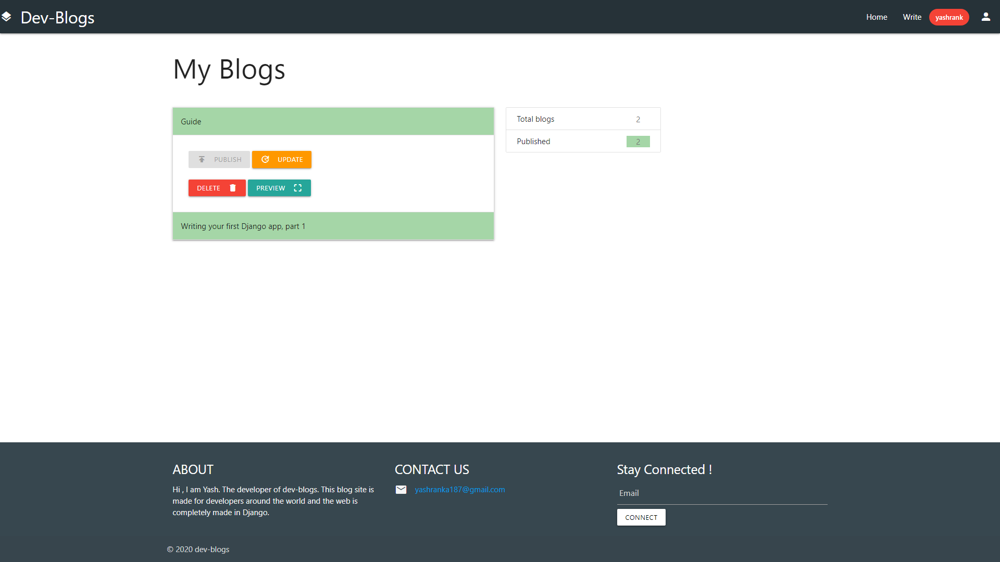
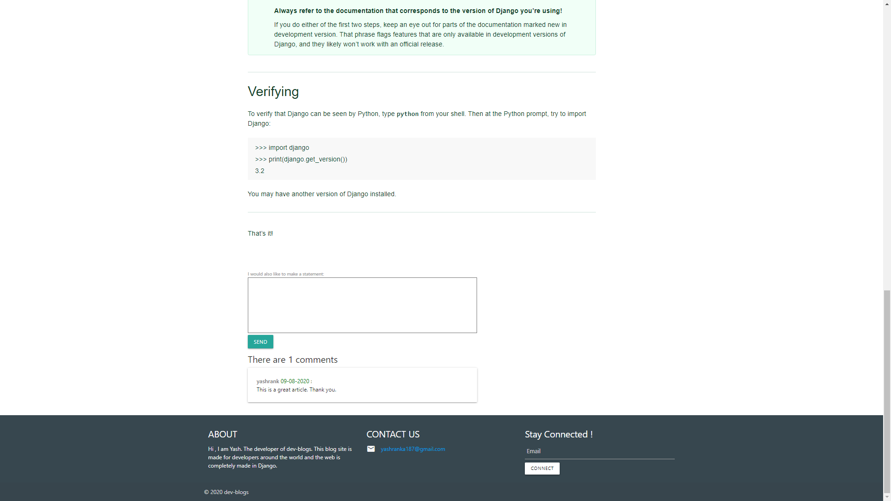
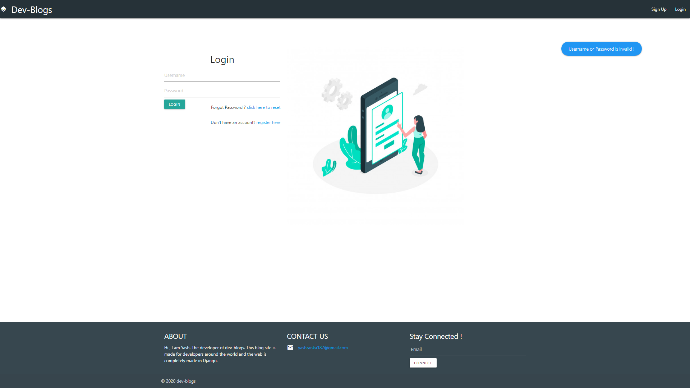
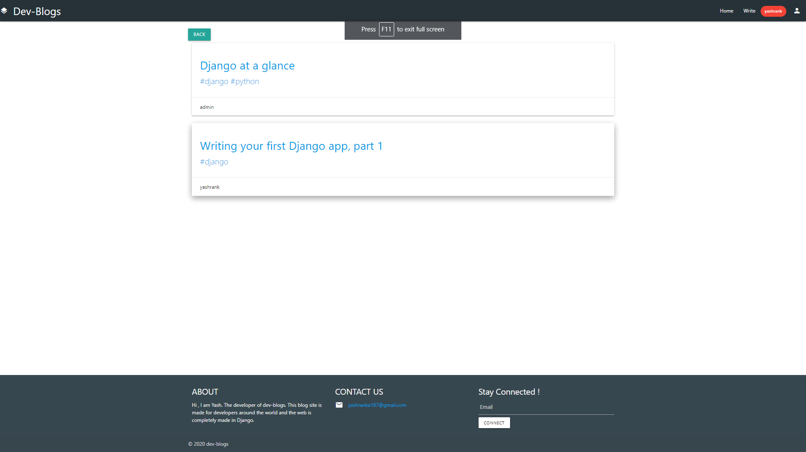

# django-blog-site
A blogging site made in python django framewok. 

## Features
### Admin Interface 
* Manage all Users and Group 
* Manage Blog posts , tags and comment 

### Authentication using django auth system
* Register
* Login
* Forgot Password( using email ) 

### Main Site - Blog 
* Read Blogs from different Users 
* Write your own blogs ( using [tinyMCE](https://www.tiny.cloud/features ) editor )
* Manage your blogs ( publish , update , delete , preview )
* Comment 
* Search across blogs

### Front-End 
* The UI part is made with simple [django template language](https://docs.djangoproject.com/en/3.0/ref/templates/language/`) and jinja 
* For css it uses [materialize-css](https://materializecss.com/) 
* Site is Responsive
  
 ### Database 
 * SQLite 
 * PostgreSQL ( configure in seetings.py )
 ---------------
 # NOTE 
 #### Before Running Project , make sure to run migration commands and createsuperuser
 #### Before using SMTP service make sure to configure it in settings.py file and in the blog_app folder utils.py 
 #### The hero-image for blogs are selected randomly.
 #### add your credentials and secret key to environment varibles
 
 -----------------------------
# here are some screenshots
##### Home-Page

##### Main-Page 

##### login

##### manage-blogs

##### write blogs

##### comments

##### messaging

##### search results

